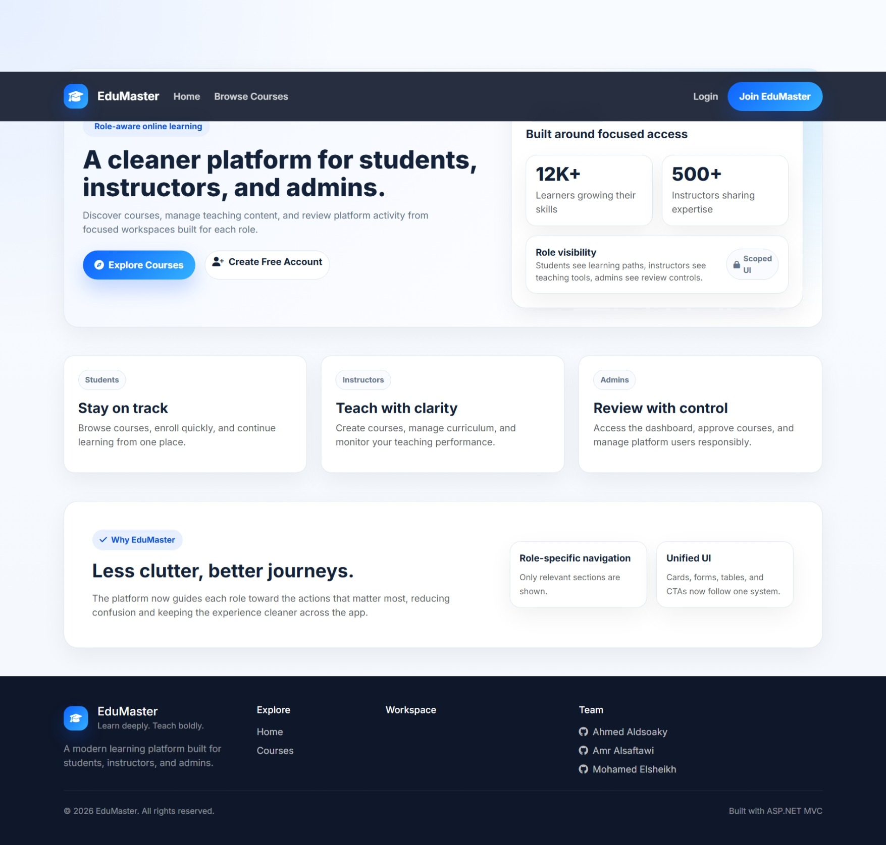
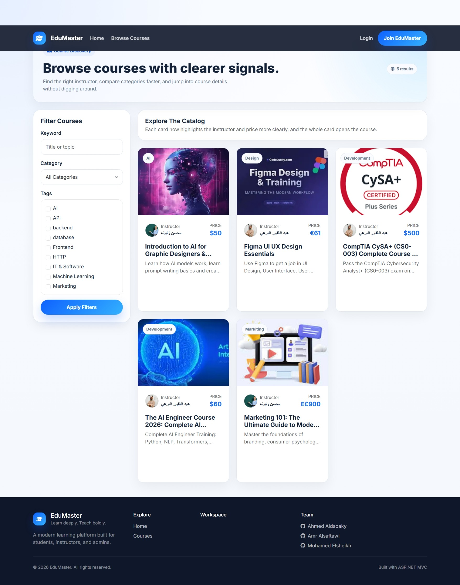
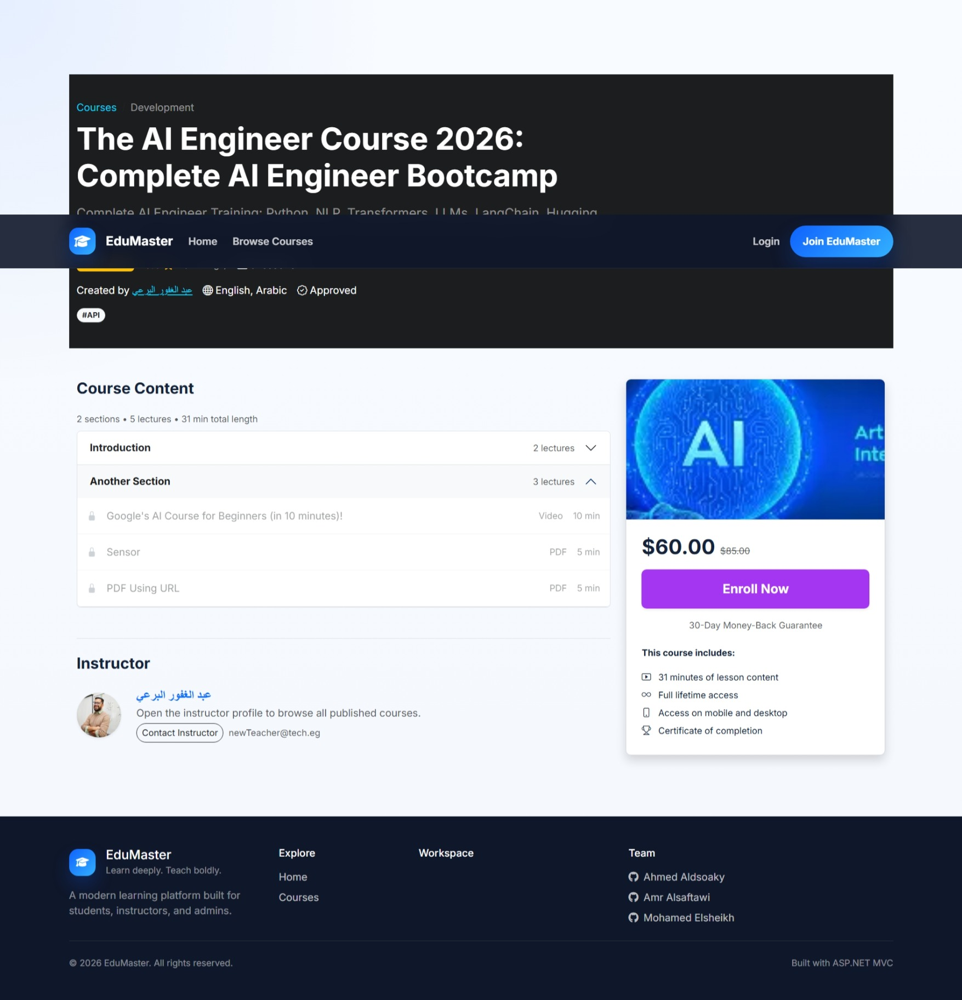
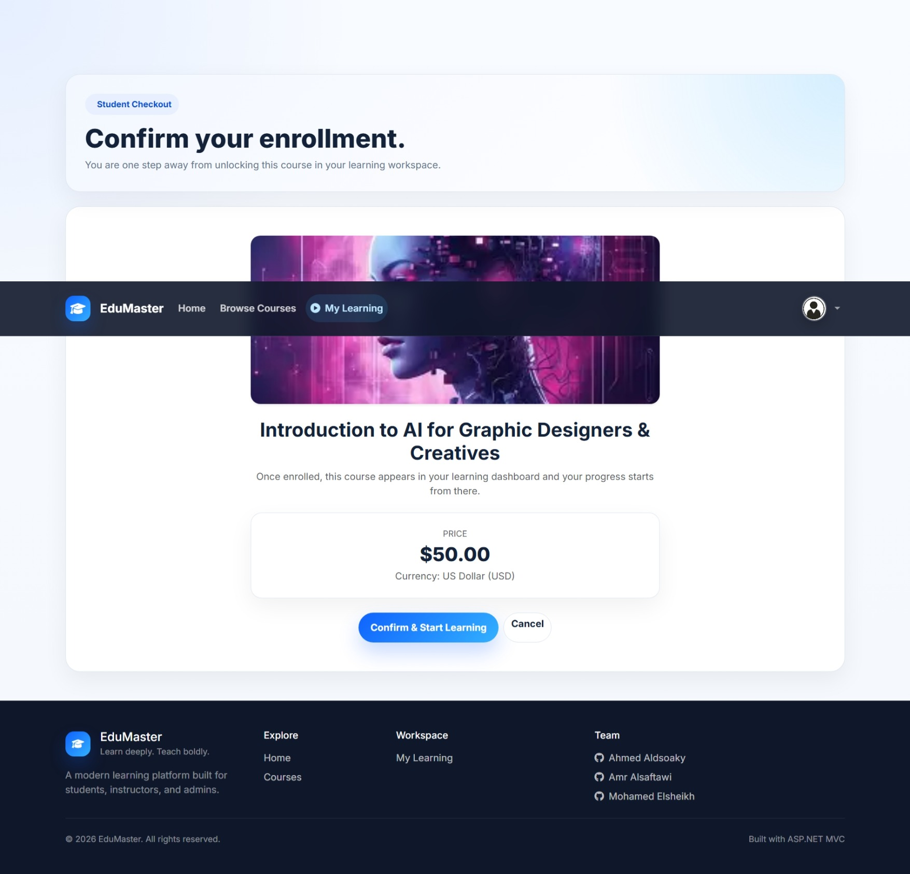
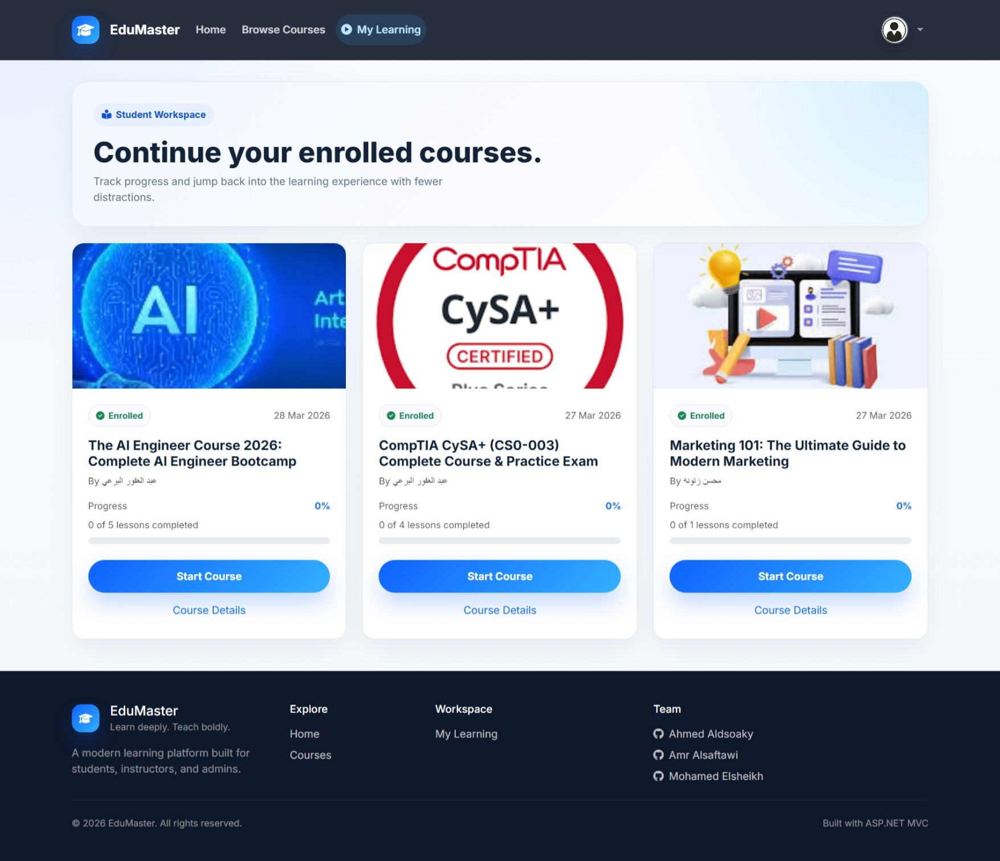
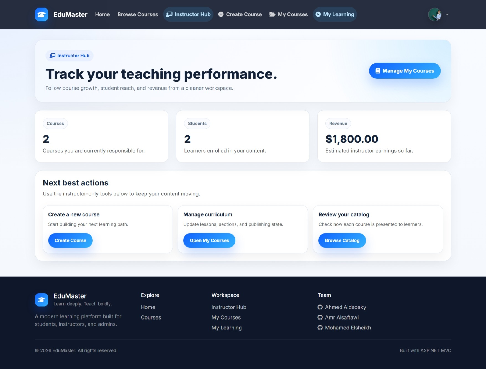
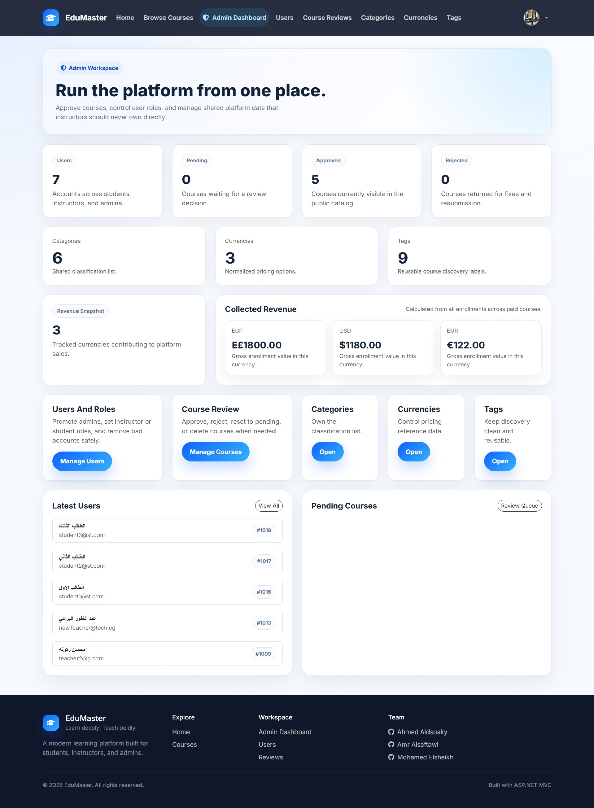

# 🎓 Online Courses Platform

<p align="center">
  <b>A Production-Ready Learning Management System (LMS) built with ASP.NET MVC</b>
</p>

<p align="center">
  
  
  
  
</p>

---

## 🚀 Overview

A full-featured **Online Learning Platform** that simulates a real-world system where:

* 🎓 Students enroll and learn
* 👨‍🏫 Instructors create and manage courses
* 🛡 Admins control and moderate the platform

> Built with **clean architecture**, **real business logic**, and **scalable design**.

---

## 🖥️ User Interface Preview

### 🏠 Home Page

<p align="center">
  
</p>

---

### 📚 Courses Listing

<p align="center">
  
</p>

---

### 📖 Course Details

<p align="center">
  
</p>

---

### 🎓 Enrollment Flow

<p align="center">
  
</p>

---

### 🎥 Learning Experience

<p align="center">
  
</p>

---

### 👨‍🏫 Instructor Dashboard

<p align="center">
  
</p>

---

### 🛡 Admin Dashboard

<p align="center">
  
</p>

---

## 🎯 Key Features

### 👥 Role-Based System

* **Student** → enroll, learn, track progress, take quizzes
* **Instructor** → create courses, upload content, manage lessons
* **Admin** → manage users, approve courses, control system

---

### 📚 Course Management

* Create & edit courses
* Upload course images
* Organize into **Sections & Lessons**
* Workflow:

  * `Pending → Approved → Rejected`

---

### 🎥 Lesson System

Supports multiple content types:

* 🔗 Video (URL-based)
* 📄 Article (file upload)
* 📕 PDF documents
* 🧠 Quiz system

---

### 📈 Learning Experience

* Track progress percentage
* Mark lessons as completed
* Continue learning feature
* Access control (must be enrolled)

---

### 🧠 Quiz Engine

* Multiple question types
* Validation & feedback
* Integrated with progress tracking

---

### 🔐 Authentication & Security

* ASP.NET Identity
* Role-based authorization
* Secure endpoints

---

### 📊 Dashboards

* Instructor stats (students, revenue, courses)
* Admin dashboard (analytics & control panel)

---

## 🏗 Architecture

Built using **Clean Layered Architecture**:

* MVC (Model - View - Controller)
* Services Layer (Business Logic)
* Repository Pattern
* DTOs & ViewModels
* Entity Framework Core

---

## ⚙️ Tech Stack

* ASP.NET Core MVC
* Entity Framework Core
* SQL Server
* AutoMapper
* ASP.NET Identity
* Bootstrap
* JavaScript / AJAX

---

## 📂 Project Structure

```bash
📦 OnlineCoursesPlatform
 ┣ 📂 Controllers
 ┣ 📂 Services
 ┣ 📂 Repositories
 ┣ 📂 Models
 ┣ 📂 ViewModels
 ┣ 📂 Dtos
 ┣ 📂 Data
 ┣ 📂 Views
 ┗ 📂 wwwroot
```

---

## 🔥 What Makes This Project Stand Out?

* Real-world **business logic (NOT CRUD)**
* Advanced **role-based system**
* Dynamic **lesson content system**
* Scalable architecture
* Clean code structure

---

## ⚠️ Challenges & Solutions

| Challenge             | Solution                         |
| --------------------- | -------------------------------- |
| Multiple lesson types | Unified content handling system  |
| Role management       | ASP.NET Identity + Authorization |
| Progress tracking     | Efficient DB updates             |
| Data consistency      | Controlled service layer         |

---

## 🚧 Future Improvements

* 💳 Payment integration
* 📺 Live sessions
* 📜 Certificates
* 📱 Mobile optimization

---

## 👨‍💻 Team

<div align="center">

<table>
<tr>

<td align="center" width="200px">
<a href="https://github.com/ahmedaldsoaky">

<br />
<sub><b>Ahmed Aldsoaky</b></sub>
</a>
<br />
<sub>.NET Backend Engineer</sub>
</td>

<td align="center" width="200px">
<a href="https://github.com/amralsaftawi">

<br />
<sub><b>Amr Alsaftawi</b></sub>
</a>
<br />
<sub>.NET Backend Engineer</sub>
</td>

<td align="center" width="200px">
<a href="https://github.com/MohamedElsheikh17">

<br />
<sub><b>Mohamed Elsheikh</b></sub>
</a>
<br />
<sub>.NET Backend Engineer</sub>
</td>

</tr>
</table>

</div>

---

## 📌 Getting Started

### 1️⃣ Clone the repository

```bash
git clone https://github.com/your-repo-link.git
```

### 2️⃣ Update Database

```bash
Update-Database
```

### 3️⃣ Run the project

```bash
dotnet run
```

---

## 💡 Final Note

This project demonstrates:

* Real-world backend engineering
* System design thinking
* Scalable architecture principles

🚀 Built to reflect production-level development, not just academic work.

---
